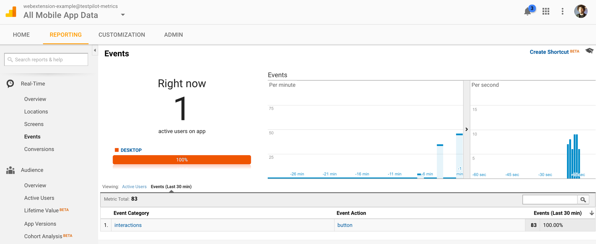

#Test Pilot Metrics SDK Example

A tiny example SDK add-on that uses testpilot-metrics to ping GA each time a toolbar button is clicked

## installation

### build steps

- Edit `index.js`, set the value of `TRACKING_ID` to your GA tracking ID.
- Install jpm globally, if you haven't already (`npm install jpm -g`).
- Build a copy of the add-on (`npm start`). The add-on will be named `test-pilot-metrics-sdk-example.xpi`.

### FF install

- Open `about:debugging` in Firefox
- Click the 'Load Temporary Add-on' button
- When the file picker opens, install this SDK add-on by choosing the `test-pilot-metrics-sdk-example.xpi` file in this directory
- If installation succeeds, you'll see 'Test Pilot Metrics SDK Example' in the list of installed add-ons, and you should also see a new toolbar button.

# use 

- Each time you click the toolbar button, you should see network activity in the Browser Toolbox network tab

GA advice:
- make it a mobile app, not a website
- go into 'real-time', then 'events', to see pings trickle in as you click the toolbar button:

